# PaSTe: Improving the Efficiency of Visual Anomaly Detection at the Edge

This repository contains supplementary plots and tables related to the work presented in the paper titled: "PaSTe: Improving the Efficiency of Visual Anomaly Detection at the Edge".

## Code repository

This project gave life to an open-source library for Visual Anomaly Detection, which is modular in nature: [MoViAD](https://github.com/AMCO-UniPD/moviad). That library contains the implementation of the algorithms used in this work, as well as the code for training and evaluating them.

```bash
git clone https://github.com/AMCO-UniPD/moviad
```


## Abstract

Visual Anomaly Detection (VAD) has gained significant research attention for its ability to identify anomalous images and pinpoint the specific areas responsible for the anomaly. A key advantage of VAD is its unsupervised nature, which eliminates the need for costly and time-consuming labeled data collection. However, despite its potential for real-world applications, the literature has given limited focus to resource-efficient VAD, particularly for deployment on edge devices.
This work addresses this gap by leveraging lightweight neural networks to reduce memory and computation requirements, enabling VAD deployment on resource-constrained edge devices. We benchmark the major VAD algorithms within this framework and demonstrate the feasibility of edge-based VAD using the well-known MVTec dataset. Furthermore, we introduce a novel algorithm, Partially Shared Teacher-student PaSTe, designed to address the high resource demands of the existing Student Teacher Feature Pyramid Matching (STFPM) approach. Our results show that PaSTe decreases the inference time by 25%, while reducing the training time by 33% and peak RAM usage during training by 76%.

## Supplementary material

### Experimental setting

#### Backbones details

- **MobileNet V2**: Available in PyTorch, using the ImageNet-pretrained version from TorchVision.  
- **MCUNet**: PyTorch-based implementation of the MCUNet-in3 network, pretrained on ImageNet and available on the official GitHub repository.  
- **PhiNet**: PyTorch-based implementation trained on ImageNet, with source code available in the MicroMind repository. The considered PhiNet uses the following hyperparameters: `num_layers = 7`, `alpha = 1.2`, `beta = 0.5`, `t0 = 6`.  
- **MicroNet**: PyTorch-based implementation of the MicroNet-m1 network, pretrained on ImageNet. Network weights are available on the official GitHub repository, while the architecture code has been refactored by us.  

#### Computational resources

The characteristics of the machine on which we run the experiments are as follows:

| Component | Specification |
| --- | --- |
| CPU | AMD Ryzen Threadripper 1920X 12- (24) @ 3.500GHz |
| RAM | 125GiB |
| GPU | NVIDIA TITAN V |
| OS | Ubuntu 18.04.6 LTS x86_64 |

### Feature extraction layers grid search

For MVTec dataset, we performed grid search on different groups of layers, to test the feature extraction at different depths.
Th following table shows the grop of layers used for feature extraction, for each backbone in the grid search.
*Low*, *Mid*, *High* refer to the depth of the layer group in the particular backbone architecture.
*Equiv* refers to the layers which are equivalent in terms of %MACs to the first three of the WideResnet 50 backbone.
Finally, PaSTe refers to the same layers as in the *Equiv* group, but the first layers have been
shifted to account for the Partial Teacher Sharing technique. 
*Last* refers to the index of the last layer of the feature extraction backbone

|        | PhiNet      | MicroNet    | MCUNet        | MobileNet V2   |
|--------|-------------|-------------|---------------|----------------|
| Low    | [4, 5, 6]   | [1, 2, 3]   | [3, 6, 9]     | [4, 7, 10]     |
| Mid    | [5, 6, 7]   | [2, 3, 4]   | [6, 9, 12]    | [7, 10, 13]    |
| High   | [6, 7, 8]   | [3, 4, 5]   | [9, 12, 15]   | [10, 13, 16]   |
| Equiv  | [2, 6, 7]   | [2, 4, 5]   | [2, 6, 14]    | [3, 8, 14]     |
| PaSTe  | [5, 6, 7]   | [3, 4, 5]   | [6, 10, 14]   | [7, 10, 14]    |
| Last   | 9           | 7           | 17            | 18             |


### Table 1 

This table reports for every AD model and for every backbone the set of layers that achieve the highest F1 pixel level score. 

| AD Model   | Backbone   | Feature Layers   | F1 pixel |
|:-----------|:-----------|:-----------------|---------:|
| CFA        | MCUNet     | [3, 6, 9]        | 0.572208 |
| CFA        | MicroNet   | [1, 2, 3]        | 0.218769 |
| CFA        | MobileNet  | [3, 8, 14]       | 0.553594 |
| CFA        | PhiNet     | [4, 5, 6]        | 0.539773 |
| PaDiM      | MCUNet     | [6, 9, 12]       | 0.502408 |
| PaDiM      | MicroNet   | [1, 2, 3]        | 0.234883 |
| PaDiM      | MobileNet  | [4, 7, 10]       | 0.533622 |
| PaDiM      | PhiNet     | [4, 5, 6]        | 0.46044  |
| PatchCore  | MCUNet     | [3, 6, 9]        | 0.530831 |
| PatchCore  | MicroNet   | [2, 3, 4]        | 0.166413 |
| PatchCore  | MobileNet  | [3, 8, 14]       | 0.526729 |
| PatchCore  | PhiNet     | [4, 5, 6]        | 0.552885 |
| STFPM      | MCUNet     | [6, 9, 12]       | 0.553616 |
| STFPM      | MicroNet   | [2, 3, 4]        | 0.176685 |
| STFPM      | MobileNet  | [4, 7, 10]       | 0.552699 |
| STFPM      | PhiNet     | [5, 6, 7]        | 0.473028 |

If you are interested in the F1 pixel level and other metrics scores obtained by the different AD models with different bakcbones and different layers on the different MVTec categories, you can see this [Table](tables/complete_table.md)

### Table 3 Extension
This is an extension of the Table 3 present in the paper. In this table all the backbones are reported. 

||                                           | PatchCore | PaDiM | CFA   | STFPM  | PaSTe
|-                  |------------------------|:---------:|:-----:|:-----:|:------:|:-------:|
|                   |  **Total Memory [MB]** | 300       | 3.72G | 141   | 189.7  | - 	   	| 
| **WideResNet50**  | **Inference [MAC]**    | 10.42G    | 9.19G | 36.89G| 18.3G  | - 		|
|                   | **AD Performance [F1]**| 0.57      | 0.57  | 0.60  | 0.51   | - 		|
|                   
|                   | **Total Memory [MB]**  | 31.11     | 49.4  | 6.16  | 5.32   | 5.11  	|  
| **MobileNetV2** 	| **Inference [MAC]**    | 235.6M    |225.5M | 2.8G  | 454.4M | 341.2M	|
|                   | **AD Performance [F1]**| 0.53      |0.49   | 0.55  | 0.52   | 0.53    |
|                   |
|                   | **Total Memory [MB]**  | 44.37     | 428.7 | 20.45 | 2.7	  | 2.5		|      
| **PhiNet**        | **Inference [MAC]**    | 2.17G     | 217M  | 3.2G  | 433.8M | 271.7M 	|      
|                   | **AD Performance [F1]**| 0.44      | 0.43  | 0.48  | 0.47	  | 0.47 	| 
|                        
|                   | **Total Memory [MB]**  | 13.1      | 2.73  | 0.727 | 0.6    | 0.59	|      
| **MicroNet-m1** 	| **Inference [MAC]**    | 29.3M     | 2.93M | 817M  | 5.86M  | 0.58M	|      
|                   | **AD Performance [F1]**| 0.16      | 0.2   | 0.07  | 0.17   | 0.17 	|    
|  
|                   | **Total Memory [MB]**  | 16.48     | 15.12 | 2.69  | 1.76	  | 1.68	|     
| **MCUNet-in3** 	| **Inference [MAC]**    | 1.1G      | 112M  | 2.9G  | 224.3M | 156.9M 	|      
|                   | **AD Performance [F1]**| 0.53      | 0.45	 | 0.55  | 0.52   | 0.52	|      

### Overall benchmark complete plot

This plot also appears in the paper without the Micronet backbone, but what follows is the complete verison.

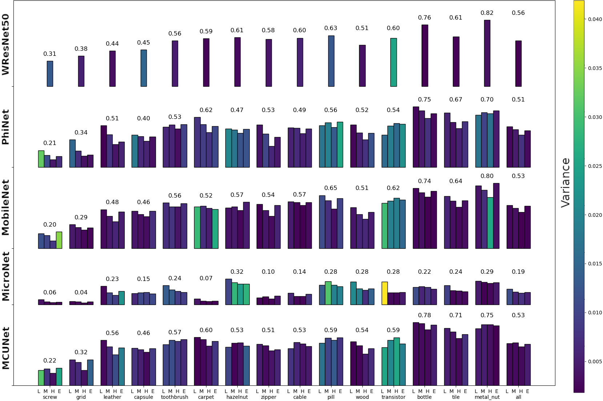

### Plot 1

This serie of line plots, given an AD model and a backbone, hihglight the F1 pixel level score of different layers on different categories.

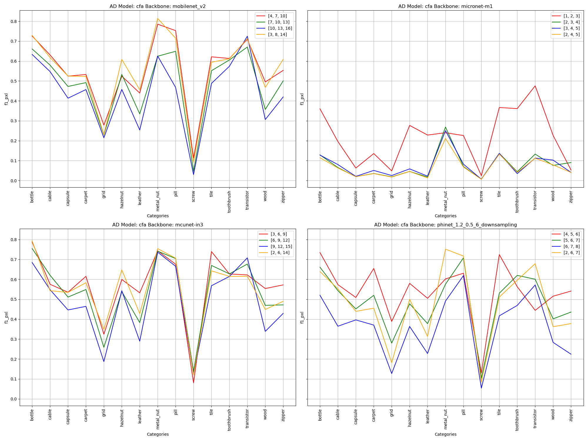
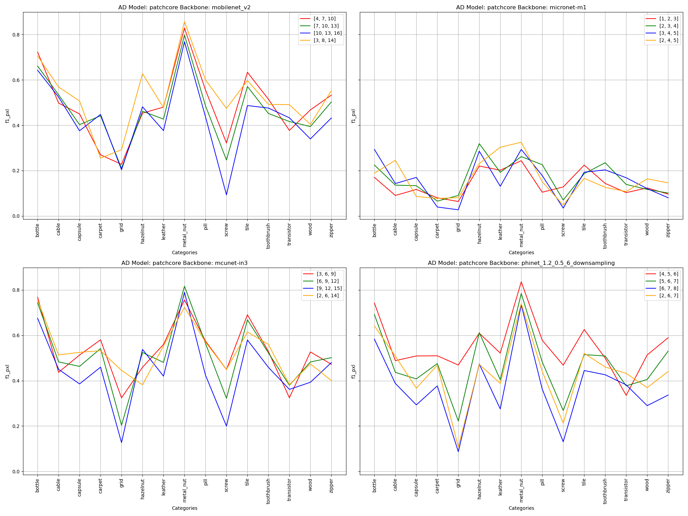
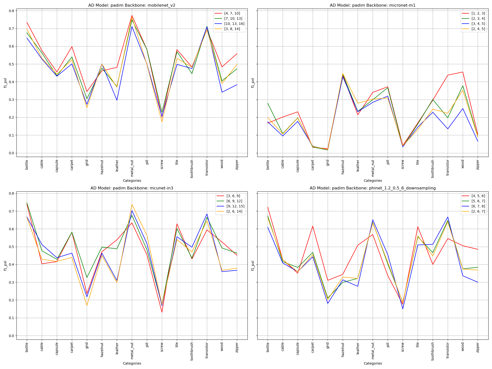
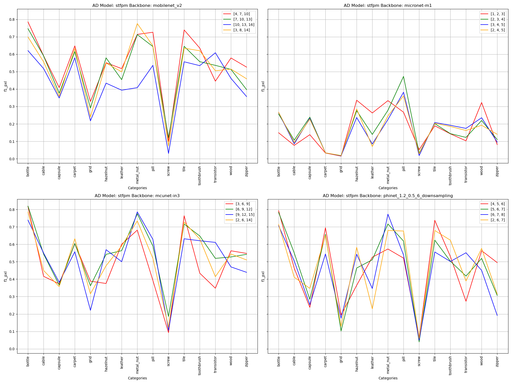


### Plot 2

This serie of line plots, given an AD model, hihglight the F1 pixel level score of the best layer for every backbone on different categories.

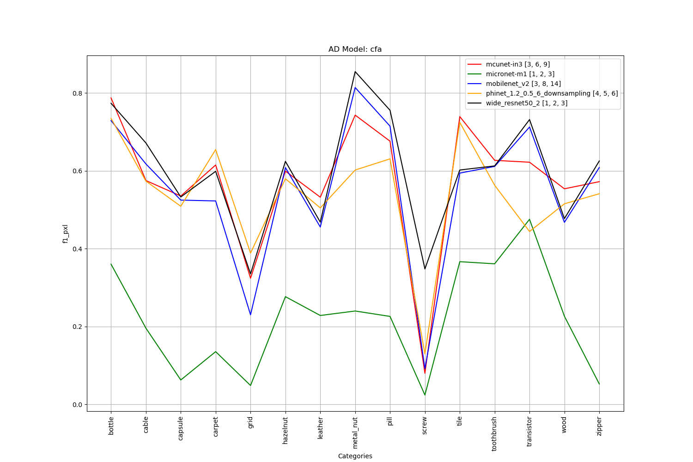
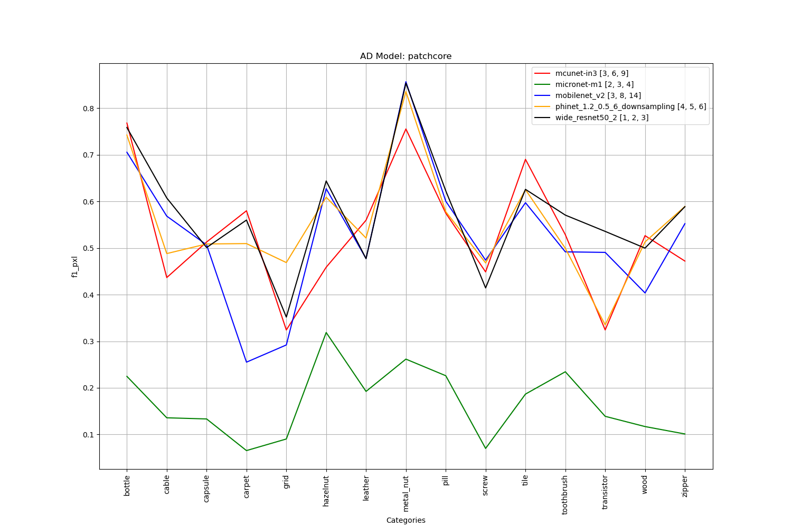
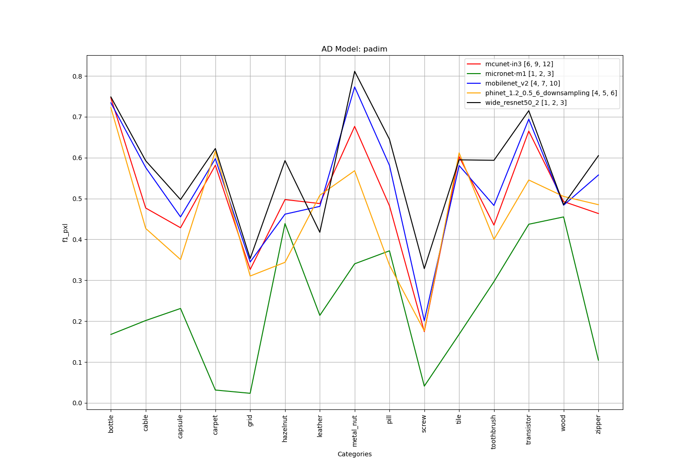
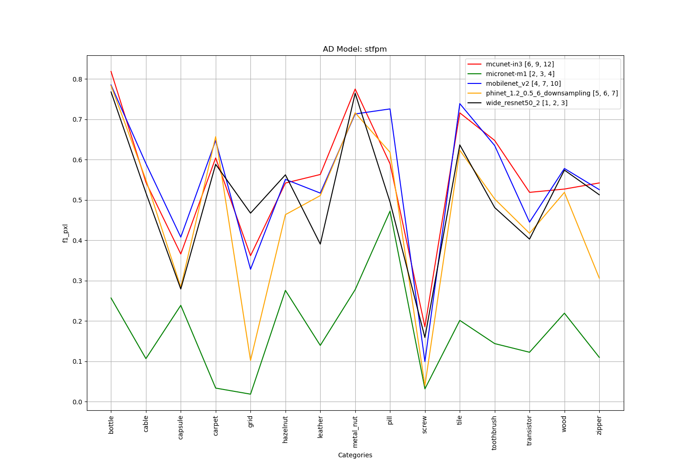


### PaSTe Performances VS Anomaly Size

The anomalies in the images have different sizes depending on the category in the MVTec AD Dataset.

By computing the mean area of anomalous pixels thanks to the ground truth present in the dataset,
we can estimate the "mean anomaly size" of each category. The following plot shows the mean anomaly area
for each category, in decreasing order.

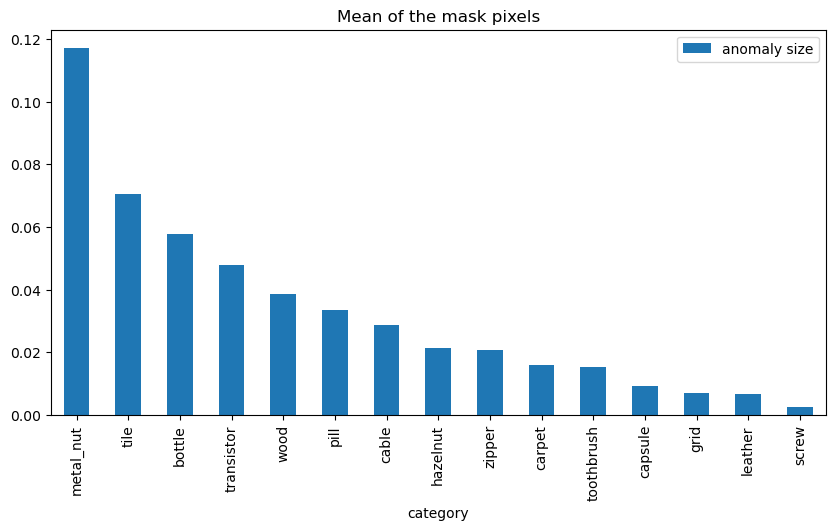

The following image helps to visualize the performances of PaSTe for each category and each backbone, 
compared to the original STFPM method, showing the small overall performance degradation of the method.

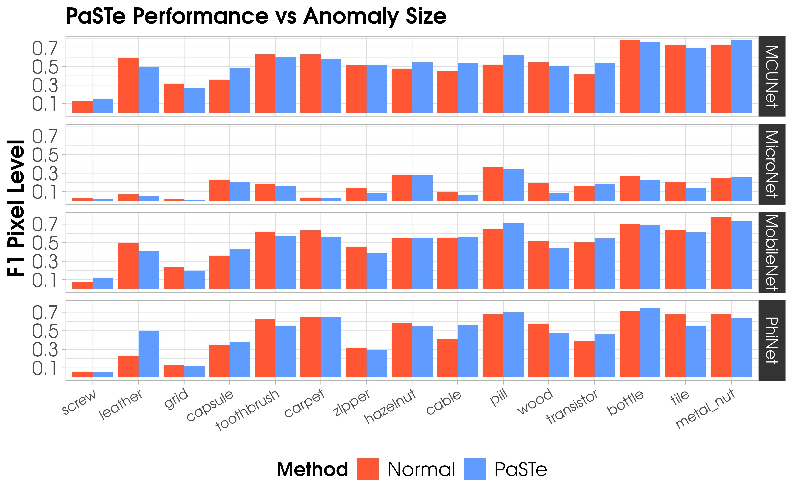


### All Evaluation Metrics - Equivalent Layers

We report all the metrics which are the most common in the context of VAD, to compare with other methods.
The metrics are referred either as Image or Pixel, depending on whether the labels are the singular pixels or the whole images.

| Method   | Backbone                      | Layers   | AUROC Image |   AUROC Pixel |   F1 Image |    F1 Pixel |   PRAUC Img |   PRAUC Pixel |   AUPRO Pixel |
|:-----------|:------------------------------|:-----------------|----------:|-------------------:|---------:|----------:|-------------:|-------------:|-------------:|
| PaDiM      | MCUNet-in3                    | [2, 6, 14]       |      0.90 |           0.95 | 0.93 | 0.44 |     0.95 |    0.37 |     0.85 |
| PaDiM      | MicroNet-m1                   | [2, 4, 5]        |      0.65 |           0.75 | 0.84 | 0.19 |     0.82 |    0.14 |     0.64 |
| PaDiM      | MobileNetV2                  | [3, 8, 14]       |      0.90 |           0.96 | 0.93 | 0.48 |     0.95 |    0.41 |     0.89 |
| PaDiM      | PhiNet | [2, 6, 7]        |      0.90 |           0.95 | 0.93 | 0.42 |     0.94 |    0.34 |     0.84 |
| PaDiM      | WideResNet50               | [1, 2, 3]        |      0.95 |           0.97 | 0.95 | 0.57 |     0.97 |    0.53 |     0.93 |
| STFPM      | MCUNet-in3                    | [2, 6, 14]       |      0.89 |           0.95 | 0.93 | 0.52 |     0.95 |    0.51 |     0.84 |
| STFPM      | MicroNet-m1                   | [2, 4, 5]        |      0.61 |           0.73 | 0.84 | 0.16 |     0.81 |    0.10 |     0.57 |
| STFPM      | MobileNetV2                  | [3, 8, 14]       |      0.88 |           0.95 | 0.93 | 0.51 |     0.95 |    0.51 |     0.82 |
| STFPM      | PhiNet | [2, 6, 7]        |      0.86 |           0.94 | 0.91 | 0.47 |     0.93 |    0.46 |     0.77 |
| STFPM      | WideResNet50               | [1, 2, 3]        |      0.85 |           0.95 | 0.92 | 0.50 |     0.92 |    0.45 |     0.89 |
| CFA        | MCUNet-in3                    | [2, 6, 14]       |      0.89 |           0.96 | 0.93 | 0.55 |     0.96 |    0.53 |     0.89 |
| CFA        | MicroNet-m1                   | [2, 4, 5]        |      0.56 |           0.51 | 0.84 | 0.06 |     0.77 |    0.03 |     0.50 |
| CFA        | MobileNetV2                  | [3, 8, 14]       |      0.93 |           0.97 | 0.95 | 0.55 |     0.97 |    0.53 |     0.89 |
| CFA        | PhiNet.5_6 | [2, 6, 7]        |      0.90 |           0.95 | 0.93 | 0.47 |     0.96 |    0.45 |     0.84 |
| CFA        | WideResNet50               | [1, 2, 3]        |      0.98 |           0.98 | 0.98 | 0.60 |     0.99 |    0.59 |     0.93 |
| PatchCore  | MCUNet-in3                    | [2, 6, 14]       |      0.97 |           0.95 | 0.96 | 0.52 |     0.98 |    0.51 |     0.88 |
| PatchCore  | MicroNet-m1                   | [2, 4, 5]        |      0.69 |           0.71 | 0.85 | 0.16 |     0.85 |    0.10 |     0.67 |
| PatchCore  | MobileNetV2                  | [3, 8, 14]       |      0.97 |           0.95 | 0.96 | 0.52 |     0.99 |    0.52 |     0.86 |
| PatchCore  | PhiNet5_6 | [2, 6, 7]        |      0.94 |           0.93 | 0.94 | 0.43 |     0.97 |    0.40 |     0.82 |
| PatchCore  | WideResNet50               | [1, 2, 3]        |      0.98 |           0.97 | 0.97 | 0.57 |     0.99 |    0.57 |     0.91 |

### ViSA Benchmark

We provide the results of the experiments conducted on the ViSA Dataset. We consider the equivalent AD layers group.

| ad_model   | backbone       | category   |    F1 pixel |   F1 image |   Image ROC AUC |   Per-pixel ROC AUC |   PR AUC image |   PR AUC pixel |   AU PRO pixel |
|:-----------|:---------------|:-----------|------------:|-----------:|----------------:|--------------------:|---------------:|---------------:|---------------:|
| CFA        | MCUNet         | Candle     | 0.231305    |   0.848571 |        0.88875  |            0.974044 |       0.904507 |    0.120537    |       0.911716 |
| CFA        | MCUNet         | Capsules   | 0.159513    |   0.785858 |        0.570167 |            0.900671 |       0.69492  |    0.0611      |       0.744196 |
| CFA        | MCUNet         | Cashew     | 0.741117    |   0.853068 |        0.8417   |            0.996184 |       0.919124 |    0.763404    |       0.862632 |
| CFA        | MCUNet         | Chewinggum | 0.258129    |   0.948362 |        0.9748   |            0.989939 |       0.988937 |    0.154468    |       0.911783 |
| CFA        | MCUNet         | Fryum      | 0.478372    |   0.858253 |        0.8325   |            0.96699  |       0.917923 |    0.429479    |       0.92766  |
| CFA        | MCUNet         | Macaroni1  | 0.0176119   |   0.741826 |        0.75415  |            0.987492 |       0.7474   |    0.00609797  |       0.933025 |
| CFA        | MCUNet         | Macaroni2  | 0.00833604  |   0.693188 |        0.62945  |            0.853579 |       0.610905 |    0.000500356 |       0.779457 |
| CFA        | MCUNet         | Pcb1       | 0.675444    |   0.862383 |        0.9068   |            0.988685 |       0.909859 |    0.70624     |       0.954699 |
| CFA        | MCUNet         | Pcb2       | 0.173599    |   0.829589 |        0.8937   |            0.981571 |       0.910147 |    0.0986074   |       0.932107 |
| CFA        | MCUNet         | Pcb3       | 0.358251    |   0.855124 |        0.899059 |            0.992115 |       0.917147 |    0.266452    |       0.926475 |
| CFA        | MCUNet         | Pcb4       | 0.384871    |   0.954659 |        0.987426 |            0.975652 |       0.985725 |    0.387022    |       0.89747  |
| CFA        | MCUNet         | Pipe_fryum | 0.656682    |   0.953751 |        0.9704   |            0.99544  |       0.984635 |    0.673298    |       0.950646 |
| CFA        | MicroNet-M1    | Candle     | 0.00701108  |   0.713922 |        0.617075 |            0.753208 |       0.632116 |    0.00220577  |       0.570341 |
| CFA        | MicroNet-M1    | Capsules   | 0.0120705   |   0.772212 |        0.440625 |            0.661585 |       0.624147 |    0.0042895   |       0.527559 |
| CFA        | MicroNet-M1    | Cashew     | 0.0233718   |   0.801606 |        0.2826   |            0.538554 |       0.59898  |    0.0114953   |       0.384105 |
| CFA        | MicroNet-M1    | Chewinggum | 0.00583875  |   0.810596 |        0.6087   |            0.534727 |       0.769513 |    0.00214929  |       0.507332 |
| CFA        | MicroNet-M1    | Fryum      | 0.0634203   |   0.831643 |        0.68125  |            0.544186 |       0.811181 |    0.0274248   |       0.393191 |
| CFA        | MicroNet-M1    | Macaroni1  | 0.000218058 |   0.738904 |        0.750925 |            0.439374 |       0.745004 |    8.00439e-05 |       0.49654  |
| CFA        | MicroNet-M1    | Macaroni2  | 0.000176037 |   0.692608 |        0.58235  |            0.475757 |       0.562619 |    6.67328e-05 |       0.474811 |
| CFA        | MicroNet-M1    | Pcb1       | 0.0102466   |   0.702535 |        0.628025 |            0.590941 |       0.657868 |    0.00423738  |       0.332694 |
| CFA        | MicroNet-M1    | Pcb2       | 0.00336491  |   0.758943 |        0.828225 |            0.547471 |       0.871989 |    0.0012199   |       0.54362  |
| CFA        | MicroNet-M1    | Pcb3       | 0.00358715  |   0.699245 |        0.693366 |            0.505946 |       0.708611 |    0.00150192  |       0.333585 |
| CFA        | MicroNet-M1    | Pcb4       | 0.0104989   |   0.713126 |        0.592129 |            0.420318 |       0.567244 |    0.00376117  |       0.43914  |
| CFA        | MicroNet-M1    | Pipe_fryum | 0.0220462   |   0.846075 |        0.80955  |            0.425121 |       0.891249 |    0.00941748  |       0.436977 |
| CFA        | MobileNetV2    | Candle     | 0.203342    |   0.830119 |        0.88675  |            0.972232 |       0.893961 |    0.0905135   |       0.899818 |
| CFA        | MobileNetV2    | Capsules   | 0.230757    |   0.793232 |        0.6915   |            0.940224 |       0.789131 |    0.111665    |       0.792896 |
| CFA        | MobileNetV2    | Cashew     | 0.618494    |   0.895826 |        0.9089   |            0.991864 |       0.95692  |    0.578428    |       0.820953 |
| CFA        | MobileNetV2    | Chewinggum | 0.10334     |   0.926601 |        0.9413   |            0.974413 |       0.974997 |    0.0467026   |       0.820782 |
| CFA        | MobileNetV2    | Fryum      | 0.467768    |   0.884636 |        0.874    |            0.965602 |       0.938365 |    0.382852    |       0.910937 |
| CFA        | MobileNetV2    | Macaroni1  | 0.0124868   |   0.714019 |        0.7401   |            0.959876 |       0.75398  |    0.00368207  |       0.874301 |
| CFA        | MobileNetV2    | Macaroni2  | 0.00249828  |   0.723981 |        0.63055  |            0.852393 |       0.572981 |    0.000355292 |       0.754194 |
| CFA        | MobileNetV2    | Pcb1       | 0.68592     |   0.869963 |        0.92985  |            0.995792 |       0.927636 |    0.742383    |       0.915668 |
| CFA        | MobileNetV2    | Pcb2       | 0.0818268   |   0.844455 |        0.91015  |            0.979924 |       0.919044 |    0.0357068   |       0.906382 |
| CFA        | MobileNetV2    | Pcb3       | 0.213318    |   0.867591 |        0.932921 |            0.989247 |       0.94137  |    0.124749    |       0.900683 |
| CFA        | MobileNetV2    | Pcb4       | 0.354631    |   0.947889 |        0.981139 |            0.973996 |       0.975888 |    0.324655    |       0.835085 |
| CFA        | MobileNetV2    | Pipe_fryum | 0.607603    |   0.945813 |        0.9635   |            0.993713 |       0.980631 |    0.586515    |       0.919101 |
| CFA        | PhiNet         | Candle     | 0.154736    |   0.824434 |        0.88865  |            0.957891 |       0.894639 |    0.0632806   |       0.864749 |
| CFA        | PhiNet         | Capsules   | 0.208617    |   0.802877 |        0.726167 |            0.925765 |       0.800389 |    0.111756    |       0.803731 |
| CFA        | PhiNet         | Cashew     | 0.657771    |   0.855676 |        0.849    |            0.993389 |       0.924214 |    0.654297    |       0.814601 |
| CFA        | PhiNet         | Chewinggum | 0.0612294   |   0.893454 |        0.9089   |            0.958683 |       0.957456 |    0.0251207   |       0.777164 |
| CFA        | PhiNet         | Fryum      | 0.488497    |   0.866704 |        0.8766   |            0.972727 |       0.939484 |    0.412406    |       0.895083 |
| CFA        | PhiNet         | Macaroni1  | 0.0079173   |   0.728835 |        0.74645  |            0.930474 |       0.727102 |    0.00142769  |       0.828528 |
| CFA        | PhiNet         | Macaroni2  | 0.0174313   |   0.711296 |        0.6607   |            0.901293 |       0.620148 |    0.00111518  |       0.772873 |
| CFA        | PhiNet         | Pcb1       | 0.498704    |   0.875622 |        0.9335   |            0.988402 |       0.929029 |    0.49966     |       0.870176 |
| CFA        | PhiNet         | Pcb2       | 0.0660156   |   0.897373 |        0.93775  |            0.976657 |       0.946004 |    0.0255313   |       0.883142 |
| CFA        | PhiNet         | Pcb3       | 0.179307    |   0.865608 |        0.93104  |            0.985183 |       0.937779 |    0.0894084   |       0.881964 |
| CFA        | PhiNet         | Pcb4       | 0.331737    |   0.958843 |        0.990149 |            0.969516 |       0.990373 |    0.280603    |       0.821217 |
| CFA        | PhiNet         | Pipe_fryum | 0.653184    |   0.929101 |        0.9488   |            0.994561 |       0.975456 |    0.689868    |       0.85964  |
| CFA        | WideResNet50-2 | Candle     | 0.232093    |   0.913333 |        0.9595   |            0.991481 |       0.963857 |    0.125767    |       0.958885 |
| CFA        | WideResNet50-2 | Capsules   | 0.425742    |   0.80312  |        0.7645   |            0.987496 |       0.841818 |    0.35401     |       0.858221 |
| CFA        | WideResNet50-2 | Cashew     | 0.708841    |   0.934    |        0.9566   |            0.996156 |       0.979352 |    0.749636    |       0.908357 |
| CFA        | WideResNet50-2 | Chewinggum | 0.229004    |   0.982561 |        0.9968   |            0.988082 |       0.998499 |    0.120574    |       0.873678 |
| CFA        | WideResNet50-2 | Fryum      | 0.495592    |   0.930239 |        0.9466   |            0.967455 |       0.977074 |    0.412124    |       0.937095 |
| CFA        | WideResNet50-2 | Macaroni1  | 0.0461246   |   0.834987 |        0.8861   |            0.989103 |       0.895397 |    0.00869534  |       0.952147 |
| CFA        | WideResNet50-2 | Macaroni2  | 0.0229756   |   0.750255 |        0.7534   |            0.971645 |       0.74698  |    0.00235072  |       0.905322 |
| CFA        | WideResNet50-2 | Pcb1       | 0.777521    |   0.953296 |        0.9864   |            0.998742 |       0.986084 |    0.862905    |       0.967421 |
| CFA        | WideResNet50-2 | Pcb2       | 0.0934032   |   0.914538 |        0.9672   |            0.984833 |       0.972328 |    0.041764    |       0.927535 |
| CFA        | WideResNet50-2 | Pcb3       | 0.245435    |   0.929993 |        0.969851 |            0.990336 |       0.972652 |    0.183031    |       0.906371 |
| CFA        | WideResNet50-2 | Pcb4       | 0.372373    |   0.967907 |        0.994158 |            0.986566 |       0.994012 |    0.395643    |       0.890221 |
| CFA        | WideResNet50-2 | Pipe_fryum | 0.674519    |   0.99     |        0.995    |            0.995395 |       0.997606 |    0.694397    |       0.958648 |
| PaDiM      | MCUNet         | Candle     | 0.0883304   |   0.786096 |        0.82885  |            0.975751 |       0.796978 |    0.0341335   |       0.887629 |
| PaDiM      | MCUNet         | Capsules   | 0.0653379   |   0.77592  |        0.646583 |            0.888711 |       0.757595 |    0.0268542   |       0.633846 |
| PaDiM      | MCUNet         | Cashew     | 0.548321    |   0.864031 |        0.8699   |            0.989551 |       0.936702 |    0.507946    |       0.812181 |
| PaDiM      | MCUNet         | Chewinggum | 0.189839    |   0.954769 |        0.9681   |            0.981688 |       0.985475 |    0.102198    |       0.875467 |
| PaDiM      | MCUNet         | Fryum      | 0.377702    |   0.88736  |        0.8851   |            0.954191 |       0.930244 |    0.297434    |       0.831283 |
| PaDiM      | MCUNet         | Macaroni1  | 0.00503883  |   0.762097 |        0.79     |            0.960324 |       0.748859 |    0.00172192  |       0.895493 |
| PaDiM      | MCUNet         | Macaroni2  | 0.00196242  |   0.69937  |        0.60345  |            0.931691 |       0.579932 |    0.000647274 |       0.757428 |
| PaDiM      | MCUNet         | Pcb1       | 0.372341    |   0.81636  |        0.8621   |            0.989425 |       0.850778 |    0.322045    |       0.911268 |
| PaDiM      | MCUNet         | Pcb2       | 0.0558554   |   0.730153 |        0.76895  |            0.965875 |       0.772958 |    0.0233491   |       0.859192 |
| PaDiM      | MCUNet         | Pcb3       | 0.120128    |   0.699902 |        0.671139 |            0.977014 |       0.674695 |    0.0791229   |       0.813348 |
| PaDiM      | MCUNet         | Pcb4       | 0.196624    |   0.911184 |        0.948465 |            0.967217 |       0.930662 |    0.115015    |       0.822792 |
| PaDiM      | MCUNet         | Pipe_fryum | 0.573522    |   0.858407 |        0.7702   |            0.99051  |       0.864098 |    0.46182     |       0.906997 |
| PaDiM      | MicroNet-M1    | Candle     | 0.00859069  |   0.724204 |        0.66465  |            0.667022 |       0.652432 |    0.00172527  |       0.599224 |
| PaDiM      | MicroNet-M1    | Capsules   | 0.0226434   |   0.769231 |        0.425333 |            0.767313 |       0.603865 |    0.00737923  |       0.565361 |
| PaDiM      | MicroNet-M1    | Cashew     | 0.284769    |   0.82358  |        0.6997   |            0.750532 |       0.821832 |    0.213621    |       0.593644 |
| PaDiM      | MicroNet-M1    | Chewinggum | 0.0068147   |   0.807307 |        0.5573   |            0.577858 |       0.743769 |    0.00247323  |       0.618695 |
| PaDiM      | MicroNet-M1    | Fryum      | 0.192211    |   0.813145 |        0.685    |            0.900889 |       0.811663 |    0.138877    |       0.690474 |
| PaDiM      | MicroNet-M1    | Macaroni1  | 0.00105471  |   0.689314 |        0.6184   |            0.888553 |       0.598322 |    0.00041534  |       0.595559 |
| PaDiM      | MicroNet-M1    | Macaroni2  | 0.00170155  |   0.677314 |        0.50415  |            0.912144 |       0.497275 |    0.000490268 |       0.724088 |
| PaDiM      | MicroNet-M1    | Pcb1       | 0.0452175   |   0.676914 |        0.53385  |            0.863096 |       0.546423 |    0.0169195   |       0.604772 |
| PaDiM      | MicroNet-M1    | Pcb2       | 0.0286028   |   0.671312 |        0.4989   |            0.896799 |       0.499878 |    0.00867811  |       0.695154 |
| PaDiM      | MicroNet-M1    | Pcb3       | 0.0352272   |   0.667781 |        0.520297 |            0.909905 |       0.529062 |    0.0129094   |       0.625771 |
| PaDiM      | MicroNet-M1    | Pcb4       | 0.0244039   |   0.665559 |        0.491238 |            0.807371 |       0.488025 |    0.0106787   |       0.473629 |
| PaDiM      | MicroNet-M1    | Pipe_fryum | 0.284998    |   0.801606 |        0.4792   |            0.936572 |       0.690662 |    0.18949     |       0.653822 |
| PaDiM      | MobileNetV2    | Candle     | 0.0943879   |   0.791101 |        0.83025  |            0.970198 |       0.787612 |    0.0323205   |       0.882386 |
| PaDiM      | MobileNetV2    | Capsules   | 0.110005    |   0.775194 |        0.635833 |            0.927872 |       0.753816 |    0.042577    |       0.681973 |
| PaDiM      | MobileNetV2    | Cashew     | 0.551394    |   0.86102  |        0.8655   |            0.986289 |       0.933091 |    0.480909    |       0.827529 |
| PaDiM      | MobileNetV2    | Chewinggum | 0.233428    |   0.951262 |        0.9727   |            0.984246 |       0.984955 |    0.12047     |       0.913041 |
| PaDiM      | MobileNetV2    | Fryum      | 0.409751    |   0.880774 |        0.8679   |            0.956229 |       0.923027 |    0.306181    |       0.861359 |
| PaDiM      | MobileNetV2    | Macaroni1  | 0.00427376  |   0.773357 |        0.8091   |            0.962542 |       0.787087 |    0.00157271  |       0.854273 |
| PaDiM      | MobileNetV2    | Macaroni2  | 0.00210729  |   0.699202 |        0.64435  |            0.94402  |       0.630348 |    0.000800304 |       0.799464 |
| PaDiM      | MobileNetV2    | Pcb1       | 0.4406      |   0.802722 |        0.8363   |            0.992304 |       0.818662 |    0.423801    |       0.916481 |
| PaDiM      | MobileNetV2    | Pcb2       | 0.0846437   |   0.74099  |        0.77     |            0.978011 |       0.775989 |    0.0349651   |       0.891297 |
| PaDiM      | MobileNetV2    | Pcb3       | 0.180088    |   0.732993 |        0.724208 |            0.984387 |       0.711686 |    0.106892    |       0.857697 |
| PaDiM      | MobileNetV2    | Pcb4       | 0.205103    |   0.867928 |        0.891089 |            0.972566 |       0.856306 |    0.131883    |       0.842193 |
| PaDiM      | MobileNetV2    | Pipe_fryum | 0.542841    |   0.909946 |        0.9157   |            0.99008  |       0.952792 |    0.444526    |       0.930702 |
| PaDiM      | PhiNet         | Candle     | 0.0966539   |   0.800832 |        0.8323   |            0.966983 |       0.790834 |    0.0327705   |       0.852545 |
| PaDiM      | PhiNet         | Capsules   | 0.0493348   |   0.783461 |        0.63275  |            0.897427 |       0.747297 |    0.0189531   |       0.570241 |
| PaDiM      | PhiNet         | Cashew     | 0.456019    |   0.87383  |        0.8912   |            0.983212 |       0.948926 |    0.385663    |       0.829896 |
| PaDiM      | PhiNet         | Chewinggum | 0.145004    |   0.941462 |        0.9679   |            0.97625  |       0.984326 |    0.0627043   |       0.821063 |
| PaDiM      | PhiNet         | Fryum      | 0.337655    |   0.882391 |        0.8384   |            0.94374  |       0.906054 |    0.236786    |       0.813162 |
| PaDiM      | PhiNet         | Macaroni1  | 0.00300588  |   0.801149 |        0.83895  |            0.95653  |       0.771986 |    0.00116003  |       0.841771 |
| PaDiM      | PhiNet         | Macaroni2  | 0.00136395  |   0.700887 |        0.6307   |            0.908488 |       0.603587 |    0.000469551 |       0.692066 |
| PaDiM      | PhiNet         | Pcb1       | 0.237318    |   0.836982 |        0.87745  |            0.97855  |       0.855598 |    0.137916    |       0.904613 |
| PaDiM      | PhiNet         | Pcb2       | 0.0591043   |   0.763261 |        0.7724   |            0.972854 |       0.754049 |    0.0244828   |       0.86675  |
| PaDiM      | PhiNet         | Pcb3       | 0.103618    |   0.729281 |        0.718218 |            0.977594 |       0.67335  |    0.0513754   |       0.836935 |
| PaDiM      | PhiNet         | Pcb4       | 0.22171     |   0.897275 |        0.925891 |            0.97331  |       0.890364 |    0.125967    |       0.841796 |
| PaDiM      | PhiNet         | Pipe_fryum | 0.497322    |   0.902012 |        0.8869   |            0.987326 |       0.928208 |    0.382163    |       0.862103 |
| PaDiM      | WideResNet50-2 | Candle     | 0.154664    |   0.80249  |        0.8315   |            0.985473 |       0.78533  |    0.0745679   |       0.945287 |
| PaDiM      | WideResNet50-2 | Capsules   | 0.19594     |   0.773697 |        0.641417 |            0.968127 |       0.74931  |    0.0906467   |       0.766291 |
| PaDiM      | WideResNet50-2 | Cashew     | 0.58389     |   0.881868 |        0.9119   |            0.991898 |       0.960034 |    0.556568    |       0.881356 |
| PaDiM      | WideResNet50-2 | Chewinggum | 0.29003     |   0.956923 |        0.9855   |            0.990975 |       0.993125 |    0.164269    |       0.914277 |
| PaDiM      | WideResNet50-2 | Fryum      | 0.473087    |   0.89378  |        0.9055   |            0.968591 |       0.952305 |    0.392644    |       0.912784 |
| PaDiM      | WideResNet50-2 | Macaroni1  | 0.0126835   |   0.800151 |        0.82305  |            0.984717 |       0.777115 |    0.00397682  |       0.942215 |
| PaDiM      | WideResNet50-2 | Macaroni2  | 0.0195695   |   0.736947 |        0.67695  |            0.968608 |       0.622912 |    0.00219197  |       0.889085 |
| PaDiM      | WideResNet50-2 | Pcb1       | 0.387177    |   0.863536 |        0.86615  |            0.993456 |       0.794478 |    0.313704    |       0.945077 |
| PaDiM      | WideResNet50-2 | Pcb2       | 0.0900817   |   0.805807 |        0.86265  |            0.985488 |       0.860872 |    0.0462287   |       0.92871  |
| PaDiM      | WideResNet50-2 | Pcb3       | 0.230062    |   0.724231 |        0.752079 |            0.989519 |       0.756654 |    0.178206    |       0.892216 |
| PaDiM      | WideResNet50-2 | Pcb4       | 0.223715    |   0.905295 |        0.926782 |            0.973753 |       0.888509 |    0.13787     |       0.837998 |
| PaDiM      | WideResNet50-2 | Pipe_fryum | 0.61766     |   0.953741 |        0.9681   |            0.993583 |       0.982882 |    0.558135    |       0.964613 |
| PatchCore  | MCUNet         | Candle     | 0.162357    |   0.850372 |        0.93455  |            0.936229 |       0.937346 |    0.0678308   |       0.851954 |
| PatchCore  | MCUNet         | Capsules   | 0.216897    |   0.815521 |        0.82075  |            0.940403 |       0.904655 |    0.122722    |       0.781793 |
| PatchCore  | MCUNet         | Cashew     | 0.309277    |   0.885119 |        0.9225   |            0.944647 |       0.964757 |    0.226596    |       0.805611 |
| PatchCore  | MCUNet         | Chewinggum | 0.235085    |   0.953124 |        0.9802   |            0.982835 |       0.990994 |    0.133071    |       0.849926 |
| PatchCore  | MCUNet         | Fryum      | 0.310781    |   0.876339 |        0.911    |            0.916419 |       0.961231 |    0.24727     |       0.897476 |
| PatchCore  | MCUNet         | Macaroni1  | 0.126988    |   0.856454 |        0.8928   |            0.966533 |       0.9084   |    0.0436615   |       0.890288 |
| PatchCore  | MCUNet         | Macaroni2  | 0.0589528   |   0.70896  |        0.7322   |            0.922372 |       0.736514 |    0.00956059  |       0.890757 |
| PatchCore  | MCUNet         | Pcb1       | 0.345703    |   0.933351 |        0.97635  |            0.976043 |       0.977957 |    0.270892    |       0.859398 |
| PatchCore  | MCUNet         | Pcb2       | 0.161606    |   0.897857 |        0.94935  |            0.899986 |       0.960261 |    0.0662959   |       0.810172 |
| PatchCore  | MCUNet         | Pcb3       | 0.256376    |   0.926933 |        0.974208 |            0.963595 |       0.974612 |    0.146994    |       0.856915 |
| PatchCore  | MCUNet         | Pcb4       | 0.262141    |   0.977905 |        0.995    |            0.953777 |       0.994202 |    0.17959     |       0.788737 |
| PatchCore  | MCUNet         | Pipe_fryum | 0.477489    |   0.944787 |        0.9577   |            0.980379 |       0.975385 |    0.404565    |       0.910378 |
| PatchCore  | MicroNet-M1    | Candle     | 0.0400892   |   0.728201 |        0.7365   |            0.714693 |       0.730337 |    0.00591783  |       0.665589 |
| PatchCore  | MicroNet-M1    | Capsules   | 0.056918    |   0.777361 |        0.533333 |            0.778255 |       0.672099 |    0.0164499   |       0.663213 |
| PatchCore  | MicroNet-M1    | Cashew     | 0.0943553   |   0.860341 |        0.8358   |            0.722293 |       0.902792 |    0.0378405   |       0.754639 |
| PatchCore  | MicroNet-M1    | Chewinggum | 0.0284374   |   0.808163 |        0.7181   |            0.648893 |       0.842289 |    0.00628367  |       0.696094 |
| PatchCore  | MicroNet-M1    | Fryum      | 0.131391    |   0.809125 |        0.7398   |            0.758161 |       0.865402 |    0.0718963   |       0.781104 |
| PatchCore  | MicroNet-M1    | Macaroni1  | 0.0035153   |   0.687658 |        0.6605   |            0.809394 |       0.649072 |    0.000563775 |       0.631335 |
| PatchCore  | MicroNet-M1    | Macaroni2  | 0.00404042  |   0.671171 |        0.56695  |            0.864856 |       0.581272 |    0.000709882 |       0.660814 |
| PatchCore  | MicroNet-M1    | Pcb1       | 0.123953    |   0.789215 |        0.83345  |            0.890031 |       0.809031 |    0.0442924   |       0.701508 |
| PatchCore  | MicroNet-M1    | Pcb2       | 0.0118441   |   0.868223 |        0.9007   |            0.72593  |       0.924142 |    0.0021732   |       0.614531 |
| PatchCore  | MicroNet-M1    | Pcb3       | 0.0340009   |   0.696994 |        0.710842 |            0.854433 |       0.749673 |    0.010364    |       0.681834 |
| PatchCore  | MicroNet-M1    | Pcb4       | 0.0238542   |   0.673477 |        0.46703  |            0.730706 |       0.489003 |    0.00999761  |       0.517266 |
| PatchCore  | MicroNet-M1    | Pipe_fryum | 0.168507    |   0.818375 |        0.7166   |            0.882021 |       0.831406 |    0.0878602   |       0.757582 |
| PatchCore  | MobileNetV2    | Candle     | 0.15729     |   0.854415 |        0.9133   |            0.924361 |       0.922879 |    0.0651537   |       0.845645 |
| PatchCore  | MobileNetV2    | Capsules   | 0.278499    |   0.781667 |        0.734833 |            0.949601 |       0.840871 |    0.172132    |       0.771469 |
| PatchCore  | MobileNetV2    | Cashew     | 0.277496    |   0.902498 |        0.9467   |            0.941451 |       0.975128 |    0.187784    |       0.810844 |
| PatchCore  | MobileNetV2    | Chewinggum | 0.168531    |   0.94324  |        0.973    |            0.957504 |       0.987883 |    0.0800977   |       0.771537 |
| PatchCore  | MobileNetV2    | Fryum      | 0.250819    |   0.887454 |        0.9191   |            0.897578 |       0.961775 |    0.186726    |       0.862954 |
| PatchCore  | MobileNetV2    | Macaroni1  | 0.0785967   |   0.763871 |        0.82785  |            0.934237 |       0.828412 |    0.0223983   |       0.853797 |
| PatchCore  | MobileNetV2    | Macaroni2  | 0.0164502   |   0.694108 |        0.69825  |            0.873805 |       0.70604  |    0.00181647  |       0.799244 |
| PatchCore  | MobileNetV2    | Pcb1       | 0.349245    |   0.915668 |        0.9724   |            0.975323 |       0.973487 |    0.277155    |       0.878244 |
| PatchCore  | MobileNetV2    | Pcb2       | 0.164215    |   0.899757 |        0.9627   |            0.917595 |       0.968228 |    0.0689477   |       0.831774 |
| PatchCore  | MobileNetV2    | Pcb3       | 0.237297    |   0.901817 |        0.959455 |            0.958306 |       0.957608 |    0.136339    |       0.826107 |
| PatchCore  | MobileNetV2    | Pcb4       | 0.268697    |   0.987537 |        0.994703 |            0.958298 |       0.993269 |    0.195887    |       0.77327  |
| PatchCore  | MobileNetV2    | Pipe_fryum | 0.320569    |   0.954774 |        0.9677   |            0.962095 |       0.984729 |    0.224362    |       0.875198 |
| PatchCore  | PhiNet         | Candle     | 0.107645    |   0.809307 |        0.87565  |            0.908568 |       0.882761 |    0.0330141   |       0.82641  |
| PatchCore  | PhiNet         | Capsules   | 0.0911021   |   0.78483  |        0.684083 |            0.8515   |       0.819425 |    0.0333397   |       0.669122 |
| PatchCore  | PhiNet         | Cashew     | 0.259716    |   0.84532  |        0.8575   |            0.94716  |       0.935818 |    0.156942    |       0.793279 |
| PatchCore  | PhiNet         | Chewinggum | 0.0959705   |   0.882109 |        0.8996   |            0.906984 |       0.954046 |    0.0321446   |       0.743392 |
| PatchCore  | PhiNet         | Fryum      | 0.291451    |   0.841156 |        0.8617   |            0.937109 |       0.934654 |    0.218056    |       0.855826 |
| PatchCore  | PhiNet         | Macaroni1  | 0.00507659  |   0.762407 |        0.80445  |            0.921943 |       0.797608 |    0.000904554 |       0.734784 |
| PatchCore  | PhiNet         | Macaroni2  | 0.00237164  |   0.687393 |        0.5679   |            0.901072 |       0.536666 |    0.000507811 |       0.731659 |
| PatchCore  | PhiNet         | Pcb1       | 0.142157    |   0.806598 |        0.8531   |            0.936151 |       0.852729 |    0.0716394   |       0.827358 |
| PatchCore  | PhiNet         | Pcb2       | 0.0729903   |   0.81915  |        0.8779   |            0.942758 |       0.885036 |    0.0247695   |       0.822226 |
| PatchCore  | PhiNet         | Pcb3       | 0.163846    |   0.779235 |        0.829356 |            0.96119  |       0.83494  |    0.0744533   |       0.803101 |
| PatchCore  | PhiNet         | Pcb4       | 0.123847    |   0.941742 |        0.984604 |            0.942772 |       0.984207 |    0.0682427   |       0.717317 |
| PatchCore  | PhiNet         | Pipe_fryum | 0.34453     |   0.875576 |        0.8773   |            0.973856 |       0.94069  |    0.254775    |       0.824686 |
| PatchCore  | WideResNet50-2 | Candle     | 0.182715    |   0.843133 |        0.92365  |            0.976655 |       0.929606 |    0.0925988   |       0.916186 |
| PatchCore  | WideResNet50-2 | Capsules   | 0.240488    |   0.788694 |        0.72475  |            0.950765 |       0.835673 |    0.149341    |       0.786917 |
| PatchCore  | WideResNet50-2 | Cashew     | 0.379893    |   0.929115 |        0.9545   |            0.958536 |       0.979091 |    0.285144    |       0.860884 |
| PatchCore  | WideResNet50-2 | Chewinggum | 0.258406    |   0.962063 |        0.9865   |            0.986577 |       0.994099 |    0.173371    |       0.860991 |
| PatchCore  | WideResNet50-2 | Fryum      | 0.313711    |   0.878192 |        0.9132   |            0.923366 |       0.961992 |    0.240496    |       0.914054 |
| PatchCore  | WideResNet50-2 | Macaroni1  | 0.0655239   |   0.789892 |        0.8521   |            0.964299 |       0.858386 |    0.017908    |       0.854323 |
| PatchCore  | WideResNet50-2 | Macaroni2  | 0.0135284   |   0.68528  |        0.54255  |            0.944422 |       0.53675  |    0.00136429  |       0.830896 |
| PatchCore  | WideResNet50-2 | Pcb1       | 0.373283    |   0.905495 |        0.94195  |            0.984207 |       0.937592 |    0.286756    |       0.908834 |
| PatchCore  | WideResNet50-2 | Pcb2       | 0.135395    |   0.828502 |        0.9043   |            0.952364 |       0.915025 |    0.0610576   |       0.857689 |
| PatchCore  | WideResNet50-2 | Pcb3       | 0.272728    |   0.834936 |        0.907327 |            0.971576 |       0.917527 |    0.157044    |       0.864959 |
| PatchCore  | WideResNet50-2 | Pcb4       | 0.357987    |   0.952859 |        0.987723 |            0.976599 |       0.98751  |    0.280101    |       0.827027 |
| PatchCore  | WideResNet50-2 | Pipe_fryum | 0.410202    |   0.965541 |        0.9868   |            0.979862 |       0.993889 |    0.322881    |       0.941822 |
| STFPM      | MCUNet         | Candle     | 0.115931    |   0.766575 |        0.78065  |            0.955312 |       0.727661 |    0.0431794   |       0.70553  |
| STFPM      | MCUNet         | Capsules   | 0.26841     |   0.810386 |        0.82775  |            0.95471  |       0.899974 |    0.159025    |       0.919756 |
| STFPM      | MCUNet         | Cashew     | 0.392583    |   0.84631  |        0.8336   |            0.853629 |       0.920811 |    0.315944    |       0.819955 |
| STFPM      | MCUNet         | Chewinggum | 0.271297    |   0.921491 |        0.9464   |            0.967494 |       0.977522 |    0.139451    |       0.914818 |
| STFPM      | MCUNet         | Fryum      | 0.391239    |   0.907765 |        0.9145   |            0.928109 |       0.952374 |    0.326758    |       0.759174 |
| STFPM      | MCUNet         | Macaroni1  | 0.0293812   |   0.72671  |        0.7545   |            0.99006  |       0.741678 |    0.0104184   |       0.85281  |
| STFPM      | MCUNet         | Macaroni2  | 0.0236896   |   0.679301 |        0.5607   |            0.976046 |       0.52816  |    0.00457455  |       0.867744 |
| STFPM      | MCUNet         | Pcb1       | 0.586595    |   0.804101 |        0.8457   |            0.992419 |       0.813581 |    0.602168    |       0.88183  |
| STFPM      | MCUNet         | Pcb2       | 0.0581806   |   0.780028 |        0.80455  |            0.960341 |       0.787303 |    0.0248858   |       0.830142 |
| STFPM      | MCUNet         | Pcb3       | 0.220567    |   0.69965  |        0.694455 |            0.977172 |       0.716942 |    0.120594    |       0.702358 |
| STFPM      | MCUNet         | Pcb4       | 0.359284    |   0.930135 |        0.971089 |            0.982143 |       0.964032 |    0.264636    |       0.808966 |
| STFPM      | MCUNet         | Pipe_fryum | 0.575998    |   0.873056 |        0.8297   |            0.992198 |       0.901657 |    0.534022    |       0.773507 |
| STFPM      | MicroNet-M1    | Candle     | 0.003985    |   0.72043  |        0.69265  |            0.545452 |       0.697773 |    0.00115389  |       0.522145 |
| STFPM      | MicroNet-M1    | Capsules   | 0.00736437  |   0.793898 |        0.614083 |            0.594526 |       0.713912 |    0.00306033  |       0.511149 |
| STFPM      | MicroNet-M1    | Cashew     | 0.0537349   |   0.8      |        0.4388   |            0.445509 |       0.651345 |    0.0207928   |       0.283201 |
| STFPM      | MicroNet-M1    | Chewinggum | 0.00362897  |   0.809046 |        0.5764   |            0.205807 |       0.712312 |    0.00105673  |       0.287783 |
| STFPM      | MicroNet-M1    | Fryum      | 0.197031    |   0.808889 |        0.694    |            0.876826 |       0.813341 |    0.133947    |       0.652198 |
| STFPM      | MicroNet-M1    | Macaroni1  | 0.00247357  |   0.672286 |        0.5221   |            0.703486 |       0.516892 |    0.00018918  |       0.522232 |
| STFPM      | MicroNet-M1    | Macaroni2  | 0.00021909  |   0.67116  |        0.481    |            0.610249 |       0.486438 |    9.22286e-05 |       0.490054 |
| STFPM      | MicroNet-M1    | Pcb1       | 0.0179485   |   0.685824 |        0.47345  |            0.637542 |       0.48262  |    0.00605427  |       0.470684 |
| STFPM      | MicroNet-M1    | Pcb2       | 0.00563002  |   0.666667 |        0.45635  |            0.736243 |       0.499181 |    0.00189232  |       0.523414 |
| STFPM      | MicroNet-M1    | Pcb3       | 0.0184176   |   0.674737 |        0.612327 |            0.832752 |       0.615116 |    0.00587209  |       0.557282 |
| STFPM      | MicroNet-M1    | Pcb4       | 0.0104882   |   0.709348 |        0.71198  |            0.539217 |       0.683195 |    0.00469622  |       0.482023 |
| STFPM      | MicroNet-M1    | Pipe_fryum | 0.146786    |   0.803433 |        0.5752   |            0.842309 |       0.743801 |    0.0692609   |       0.538522 |
| STFPM      | MobileNetV2    | Candle     | 0.134784    |   0.765601 |        0.77525  |            0.971924 |       0.718632 |    0.053001    |       0.69227  |
| STFPM      | MobileNetV2    | Capsules   | 0.289019    |   0.806534 |        0.8155   |            0.971207 |       0.878691 |    0.171779    |       0.866541 |
| STFPM      | MobileNetV2    | Cashew     | 0.457424    |   0.889423 |        0.9162   |            0.919452 |       0.960135 |    0.398164    |       0.815371 |
| STFPM      | MobileNetV2    | Chewinggum | 0.233495    |   0.907282 |        0.926    |            0.979383 |       0.969078 |    0.128545    |       0.886183 |
| STFPM      | MobileNetV2    | Fryum      | 0.418271    |   0.885367 |        0.9054   |            0.943884 |       0.953565 |    0.377723    |       0.794035 |
| STFPM      | MobileNetV2    | Macaroni1  | 0.0159746   |   0.747884 |        0.76495  |            0.990427 |       0.733323 |    0.00594644  |       0.649858 |
| STFPM      | MobileNetV2    | Macaroni2  | 0.0127591   |   0.690693 |        0.57095  |            0.981467 |       0.518517 |    0.00407763  |       0.918475 |
| STFPM      | MobileNetV2    | Pcb1       | 0.597614    |   0.819959 |        0.86465  |            0.993469 |       0.841576 |    0.64542     |       0.854905 |
| STFPM      | MobileNetV2    | Pcb2       | 0.0670248   |   0.790821 |        0.80985  |            0.963965 |       0.799734 |    0.0284528   |       0.805507 |
| STFPM      | MobileNetV2    | Pcb3       | 0.210261    |   0.779229 |        0.822376 |            0.981323 |       0.817854 |    0.127097    |       0.728579 |
| STFPM      | MobileNetV2    | Pcb4       | 0.321206    |   0.929033 |        0.96297  |            0.9781   |       0.953341 |    0.215717    |       0.800361 |
| STFPM      | MobileNetV2    | Pipe_fryum | 0.576133    |   0.921951 |        0.9371   |            0.991525 |       0.965873 |    0.515362    |       0.792239 |
| STFPM      | PhiNet         | Candle     | 0.050334    |   0.765578 |        0.76365  |            0.911823 |       0.696289 |    0.0166334   |       0.621496 |
| STFPM      | PhiNet         | Capsules   | 0.251387    |   0.794071 |        0.778167 |            0.969592 |       0.859193 |    0.141336    |       0.787927 |
| STFPM      | PhiNet         | Cashew     | 0.277815    |   0.828816 |        0.8264   |            0.772049 |       0.918812 |    0.195353    |       0.875675 |
| STFPM      | PhiNet         | Chewinggum | 0.133276    |   0.841684 |        0.8163   |            0.840136 |       0.899947 |    0.0447717   |       0.760824 |
| STFPM      | PhiNet         | Fryum      | 0.377806    |   0.868472 |        0.8685   |            0.932648 |       0.93605  |    0.317763    |       0.882275 |
| STFPM      | PhiNet         | Macaroni1  | 0.010109    |   0.736592 |        0.7567   |            0.974987 |       0.751974 |    0.00295703  |       0.760198 |
| STFPM      | PhiNet         | Macaroni2  | 0.0108129   |   0.676028 |        0.50055  |            0.974644 |       0.504364 |    0.00285572  |       0.780706 |
| STFPM      | PhiNet         | Pcb1       | 0.274547    |   0.706401 |        0.69635  |            0.961537 |       0.661173 |    0.156579    |       0.823578 |
| STFPM      | PhiNet         | Pcb2       | 0.0581177   |   0.741694 |        0.7477   |            0.948058 |       0.713331 |    0.0235729   |       0.848767 |
| STFPM      | PhiNet         | Pcb3       | 0.153792    |   0.722763 |        0.740495 |            0.963872 |       0.742467 |    0.0726276   |       0.670685 |
| STFPM      | PhiNet         | Pcb4       | 0.16898     |   0.926447 |        0.965842 |            0.956876 |       0.960295 |    0.0972095   |       0.754459 |
| STFPM      | PhiNet         | Pipe_fryum | 0.481095    |   0.905385 |        0.9202   |            0.986929 |       0.961618 |    0.383801    |       0.80807  |